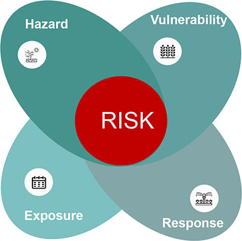

class: center, middle

.title[Uncertainty and Risk]
<br>
.subtitle[BEE 4750/5750]
<br>
.subtitle[Environmental Systems Analysis, Fall 2022]
<hr>
.author[Vivek Srikrishnan]
<br>
.date[August 31, 2022]

---
name: toc

class: left

# Outline
<hr>

1. Questions?
2. 

---
name: questions

class: left

# Questions?
<hr>

.right-column[]

---
name: question results

class: left

# Questions!
<hr>

<div style='position: relative; padding-bottom: 56.25%; padding-top: 35px; height: 0; overflow: hidden;'><iframe sandbox='allow-scripts allow-same-origin allow-presentation' allowfullscreen='true' allowtransparency='true' frameborder='0' height='315' src='https://www.mentimeter.com/embed/6303ba2d8e533f56abac388386c31d71/d52e8876481e' style='position: absolute; top: 0; left: 0; width: 100%; height: 80%;' width='420'></iframe></div>

---
name: announcements

class: left

# Announcements
<hr>

---
name: uncertainty

class: left

# What Is Uncertainty?
<hr>

**Glib Answer**: *A lack of certainty!*

--

**More Seriously**: Uncertainty refers to an inability to exactly describe current or future values or states.

---
name: uncertainty-types

# Types of Uncertainty

Broadly speaking, there are two types of uncertainty:

.left-column[* **Epistemic Uncertainty**: Uncertainty resulting from a lack of knowledge
* **Aleatory Uncertainty**: Uncertainty resulting from underlying randomness
]

.right-column[.centered[

<br>
.cite[Source: <https://xkcd.com/2440>]
]]

---
name: probability

# Uncertainty and Probability

We often represent uncertainty using *probabilities*.

What is probability?

--
* Long-run frequency of an event (**frequentist**)
--
* Degree of belief that a proposition is true (**Bayesian**)
--

The frequentist definition concerns what would happen with a large enough number of repeated trials. The Bayesian definition concerns the odds that you should bet on an outcome. 

---
name: distributions

# Probability Distributions

.left-column[The likelihood of possible values of an unknown quantity are often represented as a probability distribution.

One key feature for systems analysis: tails! These can represent low-probability but high-impact outcomes (more on this later...)]

```@eval
using Distributions, Plots, StatsPlots
ENV["GKSwstype"] = "100"

x = range(-10, 10; length = 100)
plot(x, pdf.(Cauchy(), x), linecolor = :red, linestyle = :dash, yaxis = false, yticks = false, grid = false, label = "Cauchy Distribution", size=(500, 400))
plot!(x, pdf.(Normal(), x), linecolor = :blue, label = "Normal Distribution")
plot!(x[x .> 1.75], pdf.(Cauchy(), x[x .> 1.75]), fillrange = pdf.(Normal(), x[x .> 1.75]), fillcolor = :red, fillalpha = 0.2, label = false, linecolor= false)
xlabel!("Value")
savefig("dist-tails.svg")

nothing
```
.right-column[.center[]]

---
name: distributions-julia

# Working with Distributions in Julia

In Julia, we use [`Distributions.jl`](https://juliastats.org/Distributions.jl/stable/) to work with probability distributions.

.left-column[
```@example
using Random, Distributions, Plots

Random.seed!(1) # set seed
# define a distribution
normal_dist = Normal(0, 1) 
# draw samples
normal_samp = rand(normal_dist, 1000)
# plot histogram
histogram(normal_samp, grid=false, 
    legend=false, ylabel="Count",
    xlabel="Value", size=(500, 400))
# save figure (not always needed)
savefig("normal_hist.svg")
nothing #hide
```
]

.right-column[.center[]]

---
name: distributions-julia-2

# Working with Distributions in Julia

We can also plot probability distribution functions (pdfs).

.left-column[
```@example
using Distributions, Plots

# set grid of x values to evaluate
x = range(-10, 10; length = 100)
# evaluate pdf over x
norm_pdf = pdf.(Normal(0, 2), x)
# make plot
plot(x, norm_pdf, linecolor=:blue, 
    legend=false, grid=false, 
    xlabel="Value", yticks=false, 
    yaxis=false, size=(500, 400))
    # save figure
savefig("dist-norm.svg")
nothing # hide
```
]

.right-column[.center[]]

---
name: risk

# Uncertainty vs. Risk

"Risk" is often (loosely) used as a substitute for probability, but...we have a term for that!

So what is risk?

The [*Society for Risk Analysis* definition](https://www.sra.org/wp-content/uploads/2020/04/SRA-Glossary-FINAL.pdf): 

>"risk" involves uncertainty about the effects/implications of an activity with respect to something that humans value (such as health, well-being, wealth, property or the environment), often focusing on negative, undesirable consequences.

---
name: risk-def

# Risk, Defined

Another good definition:

> the potential for consequences where something of value is at stake and where the outcome is uncertain, recognizing the diversity of values. Risk is often represented as probability of occurrence of hazardous events or trends multiplied by the impacts if these events or trends occur.

> .footer[-- [Oppenheimer et al (2014)](https://www.ipcc.ch/site/assets/uploads/2018/02/WGIIAR5-Chap19_FINAL.pdf)]

---
name: risk-components

# Components of Risk

.left-column[
The previous definition of risk specifies multiple components which contribute to risk:
* Probability of a **hazard**;
* **Exposure** to that hazard;
* **Vulnerability** to bad outcomes;
* Another: Socioeconomic **responses**.
]

.right-column[.center[
<br>
.cite[Source: [Simpson et al (2021)](https://doi.org/10.1016/j.oneear.2021.03.005), Adapted by David Gold and the MultiSector Dynamics Community of Practice]
]]

---
name: risk-water

# Risk Example 1: Well Contamination

Consider the potential contamination of well water. How could we mitigate risk by:

--
* reducing **hazards**:
--
* reducing **exposure**:
--
* reducing **vulnerability**:
--
* influencing **responses**:

---
name: risk-covid

# Risk Example 2: COVID-19

Now consider the risk of COVID-19 spread. How could we mitigate risk by:

--
* reducing **hazards**:
--
* reducing **exposure**:
--
* reducing **vulnerability**:
--
* influencing **responses**:

---
name: risk-systems

# Risk and Systems Analysis

Risk management is often a key consideration in systems analysis.

For example, consider regulatory standards.

--
* These standards are often set to reduce exposure or vulnerability to a hazard, like pollutant exposure.
--
* As we will see, there is often a tradeoff between strictness of a regulation and costs of compliance.
--
* But relaxing these standards can increase risk!

---
name: risk-models

# Risk Modeling

We've discussed how we can use simulations models to understand systems dynamics.

To model risk:
* Identify probability distributions for input(s) which influence hazards, vulnerability, or exposure (this is a key step in *uncertainty quantification*);
* Propagate samples from these distributions through the model.
* Examine distributions of relevant output(s).

Notice: this can require a *lot* of model evaluations, especially when considering tail risks. This makes it difficult to do risk analysis with complex, computationally-expensive models.

---
name: correlationsß

# Correlated Uncertainties

A key consideration when quantifying uncertainties: which parameters are **correlated**?

In other words, do large/small values of these parameters tend to occur together? Or are the values independent?

---
name: correlations-climate

# Correlated Uncertainties: Climate

**ADD CS/OHC EXAMPLE**

---
name: correlations-lake

# Correlated Uncertainties: Lake Eutrophication

